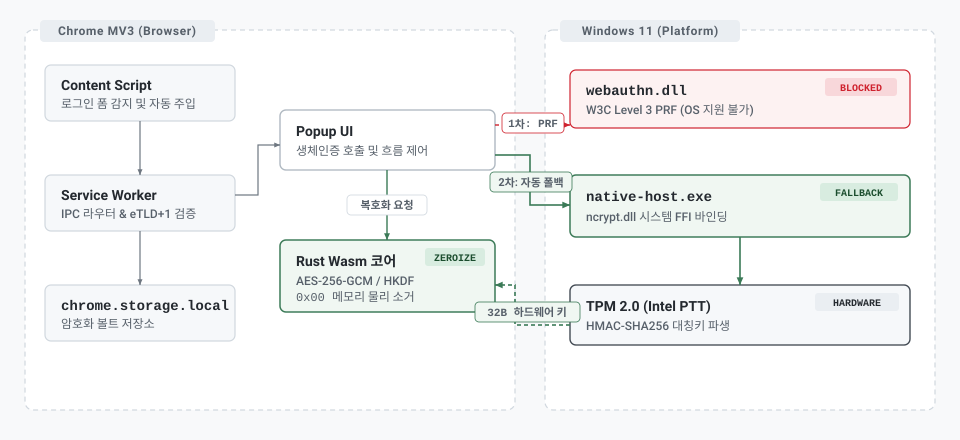
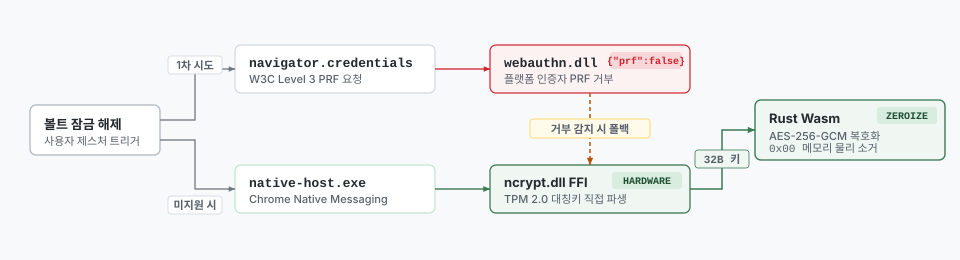

# PrfVault

> WebAuthn PRF 기반 Zero-Server 하드웨어 바인딩 로컬 볼트 및 국내 웹 환경 보안 실태 연구

PrfVault는 중앙 인증 서버에 의존하지 않고 사용자 기기의 하드웨어 보안 모듈(TPM 2.0 또는 Windows Hello)을 유일한 신뢰 기준점으로 삼는 크롬 확장프로그램입니다.

---

## 1. 프로젝트 발의 배경과 실증적 문제의식

### 1.1 출발점: 레거시 웹 환경의 2차 인증 부재 관찰
* 타 대학에 재학 중인 동료의 졸업 캡스톤 프로젝트 주제를 함께 고민하던 중, 동료의 대학교 포털을 비롯한 국내 다수 웹 서비스가 여전히 2차 인증 없이 단순 비밀번호 단일 체계로 운영되는 현실을 확인했습니다.
* 본인 소속 대학 역시 입학 후 오랜 기간 단일 비밀번호 체제를 유지하다가 약 1년 전에야 2차 인증을 도입했습니다.
* *"서버 인프라를 외부에서 바꿀 수 없는 제약 속에서, 클라이언트 확장프로그램이 주도하여 취약한 웹사이트에 하드웨어 수준의 계정 보호를 강제할 수는 없을까?"*라는 질문이 본 연구의 출발점이었습니다.

### 1.2 중앙화 패스워드 매니저의 단일 장애점 탈피
* 1Password, Bitwarden, LastPass 등 상용 서비스는 암호화된 볼트를 중앙 클라우드 서버에 저장합니다.
* 그러나 중앙 저장소는 침해 사고가 일어났을 때 모든 사용자의 볼트 데이터가 한 번에 유출되는 단일 장애점 위험을 안고 있습니다.
* 외부 서버를 완전히 배제하고 사용자 PC의 하드웨어 칩 내부에서만 키를 파생하는 구조를 설계하여 서버 침해 경로를 원천 차단하고자 했습니다.

### 1.3 인간의 기억 한계와 비밀번호 재사용의 딜레마
* 사용자가 여러 웹사이트에 동일한 비밀번호를 재사용하는 이유는 보안 의식이 부족해서라기보다, 복잡한 문자열을 여러 개 외우기 어려운 인간 기억의 물리적 한계 때문입니다.
* 사용자가 암호를 직접 외울 필요 없이 기기 생체인증 한 번으로 사이트별 고엔트로피 비밀번호를 생성하고 주입해 준다면 비밀번호 재사용 문제를 해결할 수 있을 것으로 판단했습니다.

---

## 2. 시스템 아키텍처 및 핵심 메커니즘

<p align="center">
  <picture>
    <source media="(prefers-color-scheme: dark)" srcset="docs/architecture/prfvault-architecture-dark.svg">
    <source media="(prefers-color-scheme: light)" srcset="docs/architecture/prfvault-architecture-light.svg">
    
  </picture>
</p>

* **Zero-Server 로컬 완결성**: 외부 원격 서버 및 클라우드 데이터베이스 통신을 일체 배제하고 클라이언트 단독으로 완결되는 구조.
* **하드웨어 대칭키 직접 파생**: TPM 2.0 내부 격리 키와 사용자 생체인증을 결합하여 256비트 대칭키 도출.
* **선형 메모리 소거와 심층 방어**:
  * Rust Wasm 내부에서 마스터 키 파생 및 복호화 연산 직후 zeroize를 호출해 0x00 물리 소거를 보장합니다.
  * V8 엔진의 문자열 불변성(String Immutability)으로 인해 DOM 주입 순간 자바스크립트 힙에 평문이 일시 잔류하는 구조적 한계를 인정하되, 수백 개 계정 평문이 장시간 상주하는 일반 확장의 노출 창(Window of Exposure)을 로그인 대상 단 1개 계정의 주입 순간(수 ms)으로 극소화하고 즉시 스코프를 닫아 가비지 컬렉터 수거 대상으로 넘기는 심층 방어(Defense in Depth)를 적용했습니다.
* **비우회 원칙**: 보안 솔루션을 억지로 뚫지 않고, 감지 시 1회용 마스킹 클립보드 폴백 제공.

---

## 3. Windows Hello / TPM 2.0 Native Host 하이브리드 파이프라인

W3C WebAuthn Level 3 PRF 확장의 브라우저 지원 파편화와 운영체제 제약을 극복하기 위해 Windows CNG 기반 Native Messaging Host 하이브리드 파이프라인을 구축했습니다.

<p align="center">
  <picture>
    <source media="(prefers-color-scheme: dark)" srcset="docs/architecture/prfvault-pipeline-dark.svg">
    <source media="(prefers-color-scheme: light)" srcset="docs/architecture/prfvault-pipeline-light.svg">
    
  </picture>
</p>

### 3.1 기술적 구현 및 플랫폼 인터페이스 차단 실증

* **표준 우선주의 하이브리드 설계**:
  * 운영체제 레벨의 차단이 확인되었음에도 네이티브 바이너리 단독 구조로 축소하지 않고 웹 표준 호출을 1차 진입점으로 유지했습니다.
  * 외장 FIDO2 보안키를 연결하거나 향후 운영체제 업데이트로 기능이 개방될 때, 추가 권한 없이 브라우저 격리 환경 안에서 즉시 키를 도출할 수 있도록 표준 호환성을 보장하기 위함입니다.
* **운영체제 내장 ncrypt.dll 직접 바인딩**:
  * 외부 암호화 라이브러리를 거치지 않고 Windows CNG 시스템 심볼을 Rust FFI로 직접 바인딩했습니다.
  * 불필요한 서드파티 의존성을 없애 소프트웨어 공급망 공격에 노출되는 범위를 최소화했습니다.
* **실기 테스트를 통한 플랫폼 제약 실증**:
  * Intel PTT TPM 2.0 기반 Windows 11 실기 환경에서 브라우저는 PRF 확장을 지원한다고 알렸으나, 운영체제 계층(`webauthn.dll`)이 내장 TPM 인증자에 대해 PRF 확장을 명시적으로 거부(`{"prf": {"enabled": false}}`)하는 현상을 실측했습니다.
  * 이는 글로벌 패스워드 매니저인 Bitwarden(Issue #19858)에서도 확인된 플랫폼 레벨의 구조적 한계입니다.
* **자동 폴백 파이프라인**:
  * 웹 표준 PRF 호출이 차단되는 즉시 Chrome Native Messaging Host로 자동 전환되어 Windows Hello TPM 2.0 하드웨어 엔클레이브에서 256비트 대칭키를 직접 파생합니다.

---

## 4. 국내 50대 웹사이트 보안 실태 벤치마크 실측 결과

Playwright 헤드리스 브라우저 자동화 도구를 사용해 국내 50대 주요 웹사이트(금융, 공공, 포털, 이커머스 등)를 전수 스캔한 실측 결과입니다.

### 4.1 핵심 정량 지표

| 평가 항목 | 표준 권고 기준 (NIST SP 800-63B) | 가상 키패드 및 길이 제한 사이트 | 실측 격차 및 위험도 |
| :--- | :---: | :---: | :---: |
| **섀넌 정보 엔트로피** | 131.09 bits ($L=20, N=94$) | **104.87 bits** (네이버, KT 16자 제한) | **20.0% 엔트로피 손실** |
| **가상 키패드 차단율** | 0.0% (표준 폼 준수) | **6.7% 차단** (삼성증권, 현대카드) | 브라우저 자동 완성 기능 무력화 |
| **단일 팩터 레거시군 차단율** | 0.0% (표준 폼 준수) | **0.0% 차단** (포털, 이커머스 등 20개소) | 표준 자동 완성 정상 동작 |

### 4.2 실제 침해 사고와의 비교 및 시사점
* 본 벤치마크 데이터를 수집하고 분석하던 2026년 9월, **신한은행 대출모집인 전용 시스템(M신한)에서 2만 5천여 명 규모의 개인정보 유출 사고**가 발생했습니다.
* 해당 사고는 2차 인증이 없는 시스템에 대해 외부 유출 계정 목록을 대입한 크리덴셜 스터핑 공격이 성공한 사례였으며, 이용자들이 외부 포털에서 쓰던 비밀번호를 그대로 재사용한 것이 침투 경로였습니다.
* 신한은행 피해자들이 가상 키패드 때문에 암호를 재사용했다고 단정할 수는 없으나, 비표준 보안 도구(가상 키패드 6.7% 차단, 16자 제한으로 엔트로피 20% 손실)가 패스워드 매니저의 안전한 무작위 암호 관리를 방해하는 환경을 조성한다는 본 연구의 가설을 정량 데이터로 뒷받침합니다.

---

## 5. 엔지니어링 포스트모템: 상용화 전환 좌절과 보안의 아이러니

### 5.1 상용화 서비스 확장의 한계
* 당초 계획은 크롬 웹스토어에 정식 배포하여 누구나 설치해 쓸 수 있는 패스워드리스 서비스로 확장하는 것이었습니다.
* 그러나 W3C WebAuthn PRF의 OS 레벨 차단으로 인해 무설치 웹 확장이 불가능해졌고, Native Host 실행 파일(`native-host.exe`) 다운로드와 레지스트리 수동 등록을 강제해야 하는 배포 장벽에 직면했습니다.

### 5.2 보안 수준과 사용성 사이의 모순
* 보안을 극대화(Zero-Server, TPM 2.0 하드웨어 바인딩)할수록 배포 편의성과 사용성은 나빠졌습니다.
* 반대로 일반적인 상용 서비스 수준의 사용성을 확보하려면 암호화된 볼트를 중앙 클라우드 서버에 올리거나 마스터 비밀번호 방식으로 후퇴하는 '보안적 타협'을 해야만 했습니다.
* Zero-Server라는 핵심 설계 철학을 훼손하면서까지 미완성 서비스를 내놓기보다, 하드웨어 규격의 플랫폼 지원 한계와 국내 웹 생태계의 모순을 증명하는 **학술적 실증 연구 프로젝트로 공식 동결**하기로 결정했습니다.

### 5.3 시스템 공학 관점의 교훈
* 표준 명세서상으로는 완벽해 보이는 암호학적 프로토콜이라도, 실제 소프트웨어는 운영체제 벤더와 하드웨어 드라이버가 쥐고 있는 권한 계층(Privilege Hierarchy)의 지배를 받는다는 현실을 배웠습니다.
* 보안 엔지니어링은 이상적인 수학 공식 구현에 그치지 않고, 플랫폼 파편화와 레거시 환경의 제약 조건을 객관적으로 계측하며 현실적인 대안을 찾아가는 과정임을 체감했습니다.

---

## 6. 기술 스택

* **Crypto Core**: Rust (`wasm-pack`, `zeroize`, `aes-gcm`, `hkdf`, `sha2`)
* **Native Host**: Rust (`windows-sys`, CNG FFI, Little-Endian Native Messaging Protocol)
* **Extension Shell**: TypeScript, Vite, CRXJS (Chrome Manifest V3)
* **Hardware Interface**: WebAuthn Level 3 PRF Extension & Windows Hello NCrypt TPM 2.0
* **Automation & Benchmark**: Python, Playwright (Chromium Headless)

---

## 7. 검증 파이프라인

모든 코드는 기계적 무결성 파이프라인을 통해 전수 검증되었습니다.

```powershell
# 1. Rust 단위/FFI 테스트 (17건 Green)
cargo test

# 2. 브라우저 확장프로그램 단위/통합 테스트 (62건 Green)
npm --prefix extension test

# 3. 브라우저 확장프로그램 MV3 프로덕션 번들 빌드
npm --prefix extension run build

# 4. Native Messaging Host 통신 파이프라인 검증 (3건 Green)
powershell -ExecutionPolicy Bypass -File scripts/test-native-host.ps1
```

---

## 8. 저장소 공식 동결 선언 (Repository Freeze)

> **REPOSITORY FREEZE NOTIFICATION**  
> 본 저장소는 계획된 모든 연구 및 실증 마일스톤(Phase 1.1 ~ Phase 5.4: WebAuthn PRF 실증, Windows Hello Native Host 하이브리드 파이프라인, 국내 50대 사이트 벤치마크 리포트)을 완료하였습니다.  
> 
> 이에 따라 본 저장소는 **2026-10-06부로 공식 동결(Freeze)** 상태로 전환되며, 보안 취약점 패치 외의 기능 추가나 리팩토링은 진행하지 않고 영구 보존됩니다.
