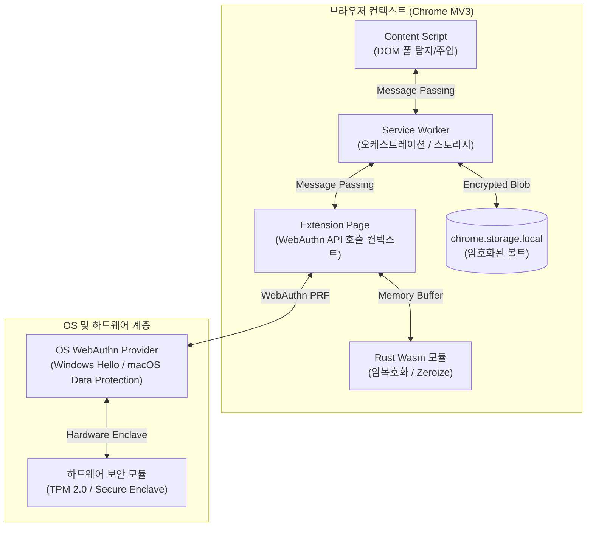

# PrfVault

> WebAuthn PRF 기반 Zero-Server 하드웨어 바인딩 로컬 볼트 및 국내 레거시 웹 환경 보안 벤치마크

PrfVault는 중앙 인증 서버 없이 사용자 기기의 하드웨어 보안 모듈(TPM 2.0 / Secure Enclave)을 신뢰 기준점으로 삼는 브라우저 확장프로그램(Chrome Manifest V3)입니다. 

W3C WebAuthn Level 3 PRF(Pseudo-Random Function) Extension을 통해 암호화 키를 하드웨어에서 직접 유도하며, 국내 50대 웹사이트의 비표준 보안 솔루션 환경(가상 키패드, E2E 암호화)에서 발생하는 '보안 모순(Security Paradox)'을 정량 데이터로 실증 분석합니다.

---

## 핵심 아키텍처

* **Zero-Server 로컬 볼트**: 외부 서버 통신을 배제하고 클라이언트 단독으로 완결되는 Zero-Trust 아키텍처.
* **WebAuthn PRF 키 유도**: TPM 2.0 내부 격리 키와 사용자 생체인증(지문/PIN)을 통한 256비트 대칭키 직접 유도.
* **Rust Wasm 메모리 소거**: 선형 메모리 내 `zeroize` 강제를 통한 키 메모리 잔류 최소화.
* **비우회(Non-Bypass) 원칙**: 보안 솔루션 강제 무력화 대신 정량 지표 기반 실태 조사 및 안전한 폴백 제공.

---

## 기술 스택

* **Crypto Core**: Rust (`wasm-pack`, `zeroize`, `aes-gcm`, `hkdf`)
* **Extension Shell**: TypeScript, Vite, CRXJS (Chrome Manifest V3)
* **Hardware Interface**: WebAuthn Level 3 PRF Extension
* **Automation & Benchmark**: Python, Playwright

---

## 문서 및 명세

세부 아키텍처 및 연구 계획은 [`docs/`](docs/) 디렉토리를 참조하십시오.

* [`docs/01-architecture-spec.md`](docs/01-architecture-spec.md): 시스템 아키텍처 및 WebAuthn PRF 키 유도 명세
* [`docs/02-threat-model-and-tradeoffs.md`](docs/02-threat-model-and-tradeoffs.md): STRIDE 위협 모델 및 한국형 보안 솔루션 간섭 분석
* [`docs/03-benchmark-and-dataset-plan.md`](docs/03-benchmark-and-dataset-plan.md): 50대 사이트 벤치마크 설계 및 Shannon Entropy 측정 공식
* [`docs/04-implementation-roadmap.md`](docs/04-implementation-roadmap.md): 구현 마일스톤 및 테스팅 계획
* [`docs/05-ipc-and-manifest-spec.md`](docs/05-ipc-and-manifest-spec.md): Chrome MV3 manifest 최소 권한 및 내부 IPC 메시지 패싱 명세
* [`docs/06-webauthn-prf-exception-flow.md`](docs/06-webauthn-prf-exception-flow.md): WebAuthn PRF 호환성 사전 감지 및 예외 처리 흐름도
