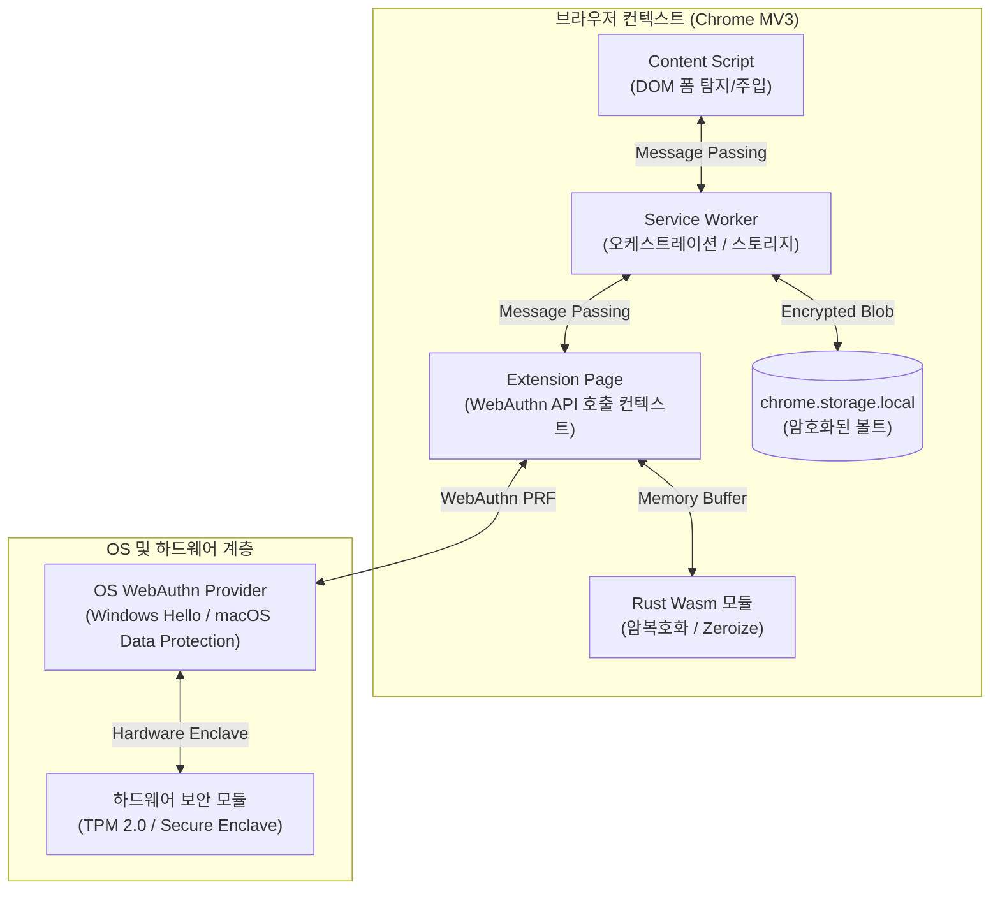
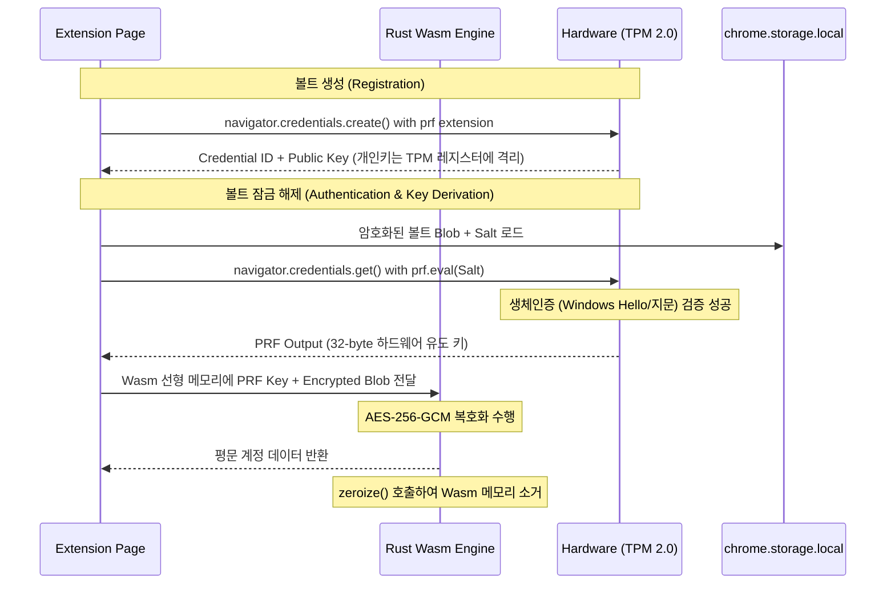
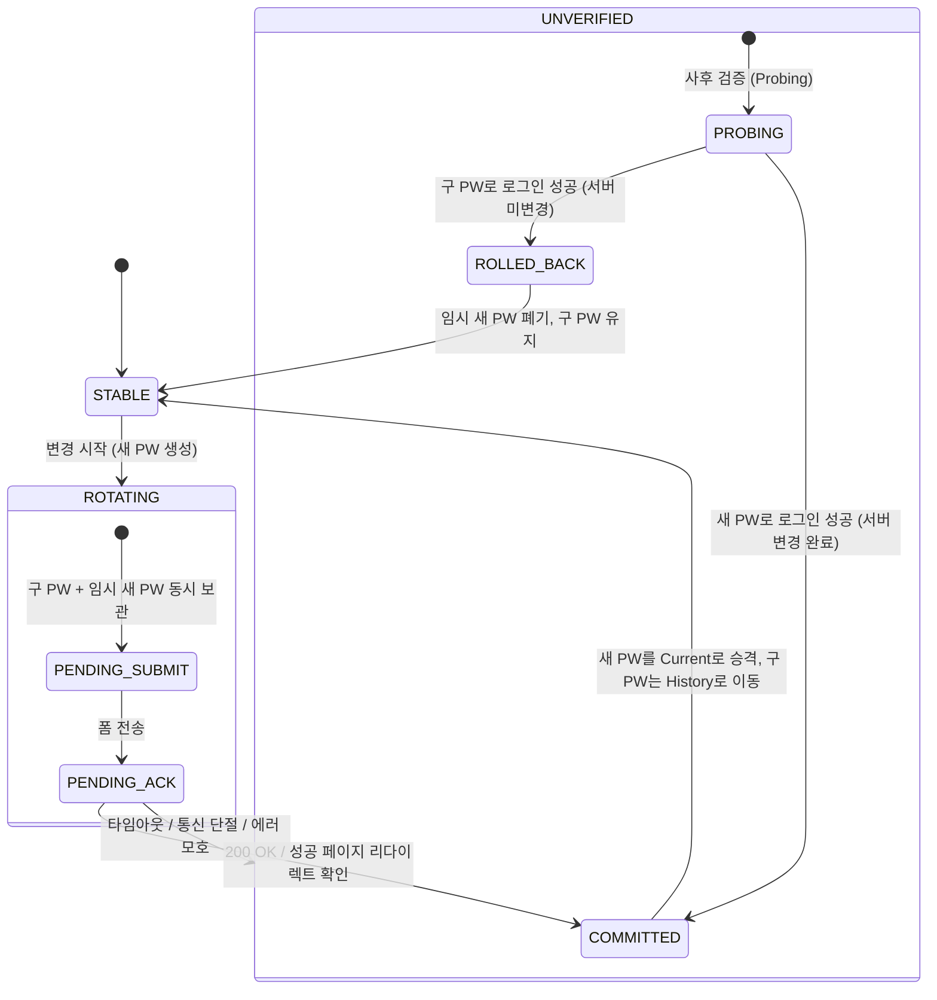

# 시스템 아키텍처 및 보안 메커니즘 명세

## 1. 아키텍처 개요

PrfVault는 외부 인증 서버 없이 사용자 PC의 하드웨어 보안 모듈(TPM / Secure Enclave)을 신뢰 기준점(Root of Trust)으로 삼는 **Zero-Server 로컬 볼트 브라우저 확장프로그램(Chrome Manifest V3)**이다.



---

## 2. WebAuthn PRF 기반 키 유도 메커니즘

### 2.1 기존 인증 방식의 한계 및 PRF 선정 이유
* **대칭키 유도 불가**: TOTP 6자리 숫자($10^6 \approx 20\text{ bit}$)나 짧은 PIN은 엔트로피가 낮다. 오프라인 무차별 대입(Brute-force) 공격에 취약하므로 로컬 대칭키 유도 함수(KDF)의 솔트나 패스워드로 쓸 수 없다.
* **비밀값 로컬 저장 모순**: TOTP Secret(Base32)을 클라이언트 스토리지에 보관하면 볼트 데이터와 함께 탈취되어 보안 경계가 무너진다.
* **WebAuthn PRF(Pseudo-Random Function) Extension**: W3C WebAuthn Level 3 명세에 정의된 확장 기능이다. 인증자(Authenticator) 내부의 비공개키와 클라이언트가 전달한 Salt를 HMAC-SHA-256 연산해 **256비트 대칭키를 직접 유도**한다. 개인키는 하드웨어 칩 외부로 절대 반출되지 않는다.

### 2.2 키 파생 및 데이터 흐름



1. **초기화 (Registration)**:
   * `navigator.credentials.create()` 호출 시 `extensions: { prf: {} }`를 넘긴다.
   * TPM 내부에 P-256 비대칭 키 쌍을 만든다. 비공개키는 하드웨어 내부 레지스터에 영구 격리한다.
   * 암호학적 난수 생성기(CSPRNG)로 32바이트 `Salt`를 생성해 메타데이터 형태로 로컬 스토리지에 저장한다.
2. **복호화 키 유도 (Key Derivation)**:
   * `navigator.credentials.get()` 호출 시 `extensions: { prf: { eval: { first: Salt } } }`를 전달한다.
   * 사용자 생체인증(PIN/지문)을 통과하면 TPM 내부에서 `HMAC-SHA-256(HardwareKey, Salt)` 연산을 실행해 32바이트 `PrfKey`를 반환한다.
3. **볼트 암호화 키 생성 (HKDF)**:
   * Wasm 모듈 내부에서 `PrfKey`를 입력 키 재료(IKM) 삼아 HKDF-SHA-256을 수행하고, 최종 볼트 암호화 대칭키(`MasterEncryptionKey`, 256-bit)를 도출한다.

---

## 3. 데이터 암호화 및 무결성 보장

* **암호화 알고리즘**: AES-256-GCM (Authenticated Encryption with Associated Data).
* **Nonce(IV) 정책**: 저장할 때마다 96비트 CSPRNG 기반 고유 Nonce를 새로 생성한다.
* **AAD(Additional Authenticated Data)**: 확장프로그램 고유 ID(`chrome.runtime.id`)와 볼트 스키마 버전을 AAD로 묶어 타 확장프로그램에 의한 볼트 데이터 교체(스왑) 공격을 막는다.
* **데이터 포맷 (바이트 레이아웃)**:
  ```
  +-------------------+----------------+----------------+--------------------+----------------+
  | Schema Ver (2B)   | Salt (32B)     | IV/Nonce (12B) | Ciphertext (Var)   | GCM Tag (16B)  |
  +-------------------+----------------+----------------+--------------------+----------------+
  ```

---

## 4. 브라우저 메모리 격리 및 Zeroize 메커니즘

### 4.1 Rust Wasm 선형 메모리 관리
* Wasm 런타임은 V8 힙과 분리된 독립 `WebAssembly.Memory`(선형 메모리 공간)를 사용한다.
* 도출된 AES 키와 평문 볼트 데이터 같은 민감 정보는 Rust 구조체에 `zeroize` 크레이트를 적용한다. 스택이나 힙에서 해제될 때 컴파일러 최적화로 메모리 지우기가 생략되지 않도록 `volatile` 쓰기(`0x00`)를 강제한다.

```rust
use zeroize::{Zeroize, ZeroizeOnDrop};

#[derive(Zeroize, ZeroizeOnDrop)]
pub struct VaultKey {
    key: [u8; 32],
}
```

### 4.2 V8 JavaScript 힙의 메모리 잔류 한계와 완화책
* **한계 (V8 String Immutability)**:
  * Wasm 메모리에서 복호화한 평문 비밀번호를 DOM 폼(`HTMLInputElement.value`)에 채우려면 JavaScript 문자열 객체로 변환해야 한다.
  * V8 엔진의 String은 불변(Immutable) 객체다. 개발자가 직접 할당 해제할 수 없으므로 V8 가비지 컬렉터의 Major GC 주기가 돌기 전까지 힙 메모리에 평문 상태로 남는다.
* **완화 정책**:
  1. **수명 최소화**: 복호화한 평문 값은 전역 변수에 캐싱하지 않는다. DOM 주입 직후 스코프를 닫아 참조 카운트를 0으로 만든다.
  2. **Content Script 주입 격리**: 주입을 마치고 `input` 이벤트를 발생시킨 즉시 메모리 참조를 해제한다.

---

## 5. 비밀번호 자동 변경 트랜잭션 및 롤백 상태 머신

웹 폼 기반 비밀번호 변경은 원자성(Atomicity)을 보장하는 분산 트랜잭션 규약이 없다. 요청 전송 후 네트워크 단절이나 패킷 유실이 발생하면 **서버와 클라이언트 중 한쪽만 비밀번호가 바뀌는 비대칭 실패**가 일어난다.

### 5.1 비대칭 장애 유형
* **클라이언트 선반영 실패**: 볼트에 새 비밀번호를 먼저 반영했으나, 웹 서버가 유효성 검증 실패(규칙 불일치)로 거부하거나 500 에러를 낸 경우.
* **ACK 유실로 인한 잘못된 롤백 (치명적)**: 웹 서버는 새 비밀번호로 변경을 마쳤으나 완료 응답(HTTP 200) 전송 중 타임아웃이 발생한 경우. 클라이언트가 이를 실패로 간주해 무조건 구 비밀번호로 되돌리면 자격 증명 불일치로 계정이 영구 잠긴다.

### 5.2 2단계 검증 상태 머신 (Two-Phase Verification State Machine)

볼트는 변경 완료가 확정되기 전까지 **이중 상태(Dual-State)**를 유지한다.



### 5.3 상태 전이 및 사후 검증(Probing) 프로토콜
1. **`ROTATING` (준비)**:
   * 볼트에 `current_password`(구 비밀번호)와 `pending_password`(새 비밀번호)를 함께 저장한다.
2. **`PENDING_ACK` (전송)**:
   * 사이트 비밀번호 변경 폼에 값을 대입하고 제출한다.
   * 명시적 성공(200 OK 또는 성공 리다이렉트)이 확인되면 즉시 `COMMITTED`로 전이한다.
3. **`UNVERIFIED` (검증 보류)**:
   * 응답 시간 초과나 네트워크 단절이 발생하면 바로 롤백하지 않고 `UNVERIFIED` 플래그를 세운다.
   * 두 비밀번호를 모두 유지한 채 대기한다.
4. **`PROBING` (능동 탐침)**:
   * 네트워크가 정상화되거나 사용자가 다음 로그인을 시도할 때 검증을 시작한다.
   * **1단계**: 새 비밀번호로 로그인을 시도한다. 성공하면 서버 변경이 완료된 것이므로 `COMMITTED`로 전이하고 이전 비밀번호를 `history`로 옮긴다.
   * **2단계**: 새 비밀번호 로그인이 실패하면 구 비밀번호로 로그인을 시도한다. 성공하면 서버가 바뀌지 않은 상태이므로 `ROLLED_BACK`으로 전이해 임시 비밀번호를 폐기한다.
   * **3단계**: 두 비밀번호 모두 로그인이 거부되면 수동 복구 경고를 표시하고 사용자 개입을 요청한다.

---

## 6. 로컬 볼트 데이터 스키마

RDBMS 없이 단일 JSON 볼트 구조 안에서 변경 이력과 감사 로그를 관리한다.

```json
{
  "version": 1,
  "updated_at": "2026-09-21T10:20:00Z",
  "accounts": [
    {
      "id": "acc_9f8b2c",
      "domain": "example.or.kr",
      "username": "user01",
      "current_password": "고엔트로피_평문_비밀번호",
      "pending_password": null,
      "state": "STABLE",
      "rotation_policy": {
        "interval_days": 90,
        "last_rotated_at": "2026-09-21T10:20:00Z"
      },
      "history": [
        {
          "password": "직전_세대_비밀번호",
          "deprecated_at": "2026-09-21T10:19:50Z",
          "status": "archived"
        }
      ],
      "audit_trail": [
        {
          "timestamp": "2026-09-21T10:20:00Z",
          "event": "PASSWORD_ROTATION_SUCCESS",
          "metadata": { "entropy_bits": 84.5 }
        }
      ]
    }
  ]
}
```
