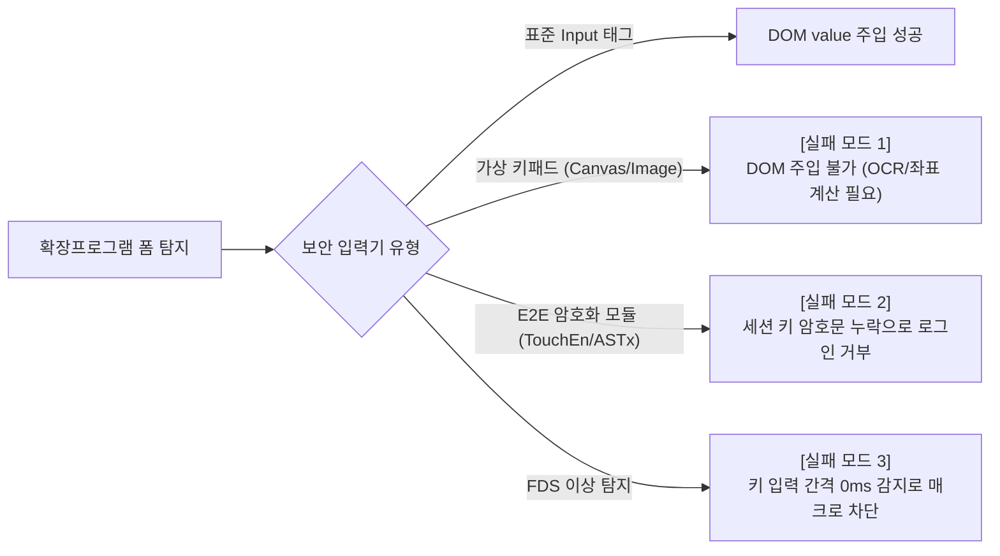

# 위협 모델 및 보안 한계 분석

## 1. 공격 표면 및 STRIDE 위협 모델링

PrfVault는 서버가 없는 클라이언트 전용 도구다. 따라서 네트워크 서버가 아닌 **클라이언트 OS, 브라우저 런타임, 웹페이지 DOM 계층**이 핵심 공격 표면(Attack Surface)이다.

| 위협 범주 (STRIDE) | 위협 시나리오 | 시스템 대응 메커니즘 | 잔존 위험 및 보안 한계 |
| :--- | :--- | :--- | :--- |
| **Spoofing (신원 도용)** | 타인이 사용자 PC에 물리적으로 접근해 볼트 잠금 해제 시도 | OS 생체인증/PIN 강제 (WebAuthn User Verification) | OS 잠금 해제 상태에서 사용자가 자리를 비웠을 때 물리적 탈취 가능 |
| **Tampering (데이터 변조)** | 악성 스크립트가 `chrome.storage.local`의 볼트 암호문 변조 | AES-256-GCM 인증 태그(Tag) 불일치 시 복호화 즉시 중단 | 볼트 데이터 파괴에 따른 서비스 거부(데이터 유실) |
| **Repudiation (부인 방지)** | 자동 변경된 비밀번호의 갱신 이력 부인 | 로컬 감사 로그(변경 일시, 도메인, 변경 전후 해시) 기록 | 제로 서버 구조상 외부 공인 타임스탬프 서버 부재 |
| **Information Disclosure (정보 유출)** | 브라우저 프로세스 메모리 덤프 또는 로컬 스토리지 파일 유출 | 볼트 암호화 저장, Wasm 선형 메모리 내 `zeroize` 강제 소거 | V8 GC 수거 전 힙 메모리에 상주하는 평문 문자열 노출 가능성 |
| **Denial of Service (서비스 거부)** | 웹사이트의 폼 구조 난독화로 자동 주입 실패 | DOM 탐지 폴백 및 휴리스틱 규칙 적용 | 가상 키패드를 강제하는 사이트에서 자동화 완전 중단 |
| **Elevation of Privilege (권한 상승)** | 웹페이지 내 XSS 스크립트의 확장프로그램 권한 탈취 시도 | Chrome MV3 격리 월드(Isolated World), 엄격한 CSP 적용 | 웹페이지 컨텍스트에서 Content Script 영역으로의 직접 침범은 원천 차단됨 |

---

## 2. 주요 공격 시나리오별 보안 경계 (Security Boundary)

### 2.1 로컬 스토리지 파일 유출
* **공격 모델**: 악성코드가 디스크 내 브라우저 프로필 디렉토리(`Local Extension Settings`)를 무단 복제.
* **방어 결과**: 볼트 파일은 AES-256-GCM으로 암호화되어 있고, 암호화 키는 사용자 기기의 TPM 2.0 칩에 묶여 있다. 따라서 유출된 파일을 다른 PC로 옮겨도 복호화할 수 없다.

### 2.2 동일 브라우저 내 악성 확장프로그램
* **공격 모델**: 같은 브라우저에 설치된 악성 확장프로그램이 본 확장프로그램의 데이터를 탈취 시도.
* **방어 결과**: Chrome 샌드박스 정책에 따라 다른 확장프로그램의 `chrome.storage.local` 접근은 원천 차단된다. 또한 AES-256-GCM AAD에 고유 ID(`chrome.runtime.id`)를 엮어 스토리지 간 데이터 교체 공격을 방어한다.

### 2.3 대상 사이트의 서버 DB 침해 (Credential Stuffing)
* **보안 한계**: 대상 사이트 서버가 해킹되어 비밀번호 해시나 평문이 유출될 경우, 클라이언트의 고강도 비밀번호 정책만으로는 서버 측 유출 피해를 직접 막을 수 없다.
* **보완 기법**: 주기적인 비밀번호 자동 갱신(Password Rotation)으로 유출된 자격 증명의 유효 수명(TTL)을 단축한다.

---

## 3. 한국형 레거시 보안 솔루션 간섭 및 실패 모드 (Failure Modes)

국내 공공·금융 사이트가 강제하는 비표준 보안 솔루션 환경에서는 다음과 같은 실패 모드가 발생한다.

### 실패 모드 1: 가상 키패드(Virtual Keypad)의 DOM 부재
* **메커니즘**:
  * 입력 필드가 표준 `<input type="password">`가 아닌 단순 이미지 클릭용 더미 엘리먼트로 구현되어 있다.
  * 키 배열은 서버가 동적으로 무작위 셔플링한 이미지 스프라이트(Canvas 또는 개별 분할 PNG)로 화면에 렌더링된다.
* **실패 원인**:
  * 텍스트 값을 직접 대입할 표준 DOM 노드가 없다.
  * 자동 입력을 구현하려면 클라이언트에서 실시간 이미지 OCR로 좌표를 역산한 뒤 가상 마우스 클릭 이벤트를 발생시켜야 하지만, 이는 사이트 디자인이나 이미지 크기가 조금만 바뀌어도 즉시 오동작한다.

### 실패 모드 2: 클라이언트 E2E 비대칭 암호화 간섭
* **메커니즘**:
  * 키보드 보안 프로그램(TouchEn nxKey, nProtect 등)은 페이지가 로드될 때 서버에서 일회성 공개키(RSA 2048 등)와 세션 토큰을 내려받는다.
  * 사용자가 키를 누르면 OS 키보드 드라이버 수준에서 입력을 가로채 암호화하고, DOM 필드에는 마스킹 문자(`●●●●`)만 찍은 뒤 히든 폼 필드에 암호문을 채운다.
* **실패 원인**:
  * 확장프로그램이 DOM `input.value`에 평문 비밀번호를 채우더라도, 보안 모듈이 채워 넣어야 하는 암호문 히든 필드는 갱신되지 않는다.
  * 서버는 복호화할 암호문이 없거나 훼손된 것으로 판단해 로그인을 최종 거부한다.

### 실패 모드 3: FDS(이상거래탐지시스템) 비정상 입력 감지
* **메커니즘**:
  * 키 입력 간격(Inter-keystroke timing)과 마우스 이동 궤적을 분석해 봇이나 매크로 여부를 판별한다.
* **실패 원인**:
  * 스크립트로 텍스트를 한 번에 대입(`value = "..."`)하면 키 입력 간격이 0ms로 측정되어 이상 징후로 탐지 및 차단된다.

---

## 4. 규제·운영 리스크와 비우회(Non-Bypass) 원칙

### 4.1 법적·약관 리스크
* **전자금융거래법 및 이용약관 충돌**: 대다수 금융기관 이용약관은 "이용자가 보안프로그램을 무력화, 우회, 변조하거나 자동화된 매크로를 사용하는 행위"를 금지한다.
* **계정 잠금 위험**: 보안 모듈을 후킹하거나 우회하려는 시도가 감지되면 FDS 룰셋에 따라 접속 IP가 차단되거나 계정이 잠길 수 있다.

### 4.2 비우회(Non-Bypass) 엔지니어링 원칙
1. **보안 모듈 강제 무력화 배제**: nProtect, ASTx 등 상용 보안 솔루션의 메모리 변조, 드라이버 후킹, 암호화 함수 리버스 엔지니어링을 통한 강제 우회는 일체 시도하지 않는다.
2. **분류 및 통계 처리**: 가상 키패드나 E2E 모듈이 활성화된 입력 필드는 "자동 주입 불가 영역"으로 안전하게 분류하고 사용자에게 수동 입력을 안내하며, 벤치마크 데이터셋의 차단 지표로만 기록한다.
3. **학술·공학적 실태 규명**: 비표준 보안 솔루션이 웹 표준 자동화와 고엔트로피 비밀번호 도입을 어떻게 가로막는지 실증 데이터를 통해 객관적으로 입증하는 근거로 삼는다.
