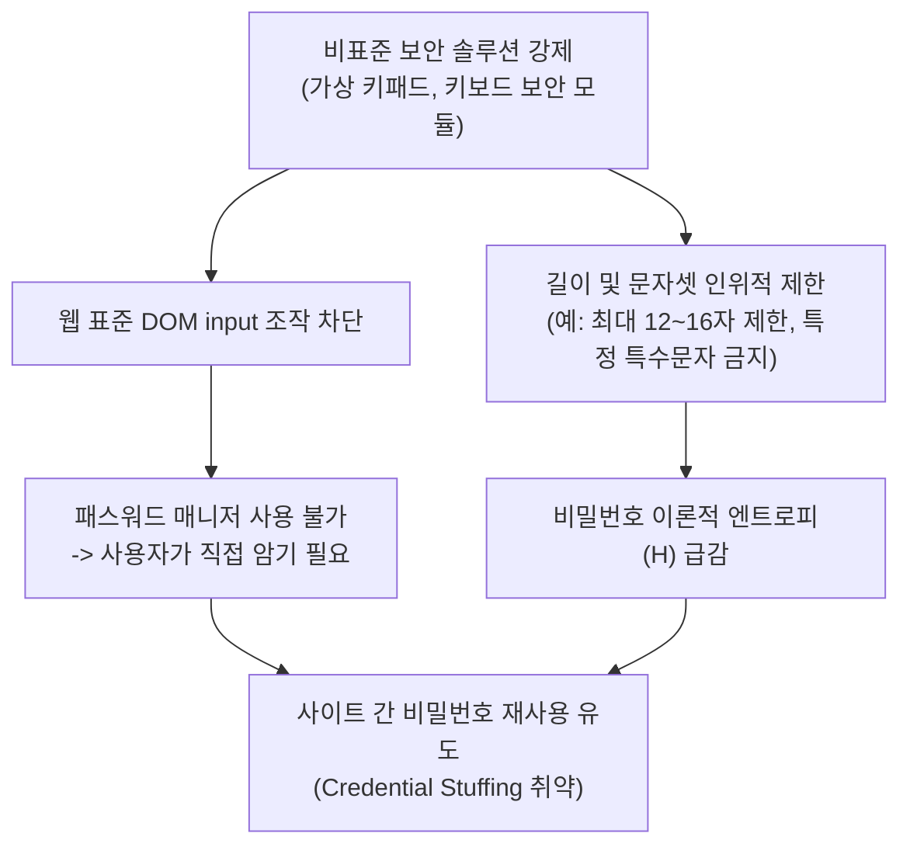
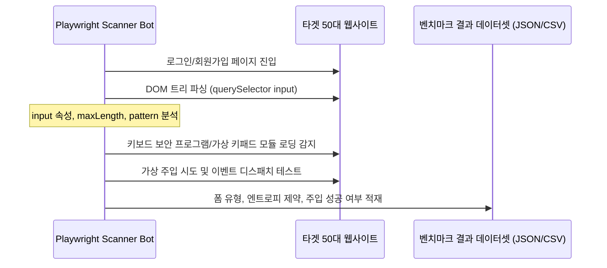

# 국내 50대 레거시 사이트 실태 조사 및 벤치마크 설계

## 1. 연구 배경 및 '보안 모순(Security Paradox)' 가설

### 1.1 가설 정의
국내 공공·금융·교육 등 레거시 웹 환경에 널리 도입된 비표준 클라이언트 보안 솔루션(키보드 보안 프로그램, 가상 키패드 등)은 **보안 강화를 목적으로 도입되었으나, 실제로는 웹 표준 패스워드 매니저의 자동 완성을 가로막고 비밀번호 엔트로피 상한을 인위적으로 낮춰 계정 보안을 오히려 취약하게 만드는 '보안 모순(Security Paradox)'을 낳는다.**

---

## 2. 표본 사이트 선정 기준 (총 50개 도메인)

국내 사용자 접속량이 많고 레거시 보안 솔루션을 유지할 가능성이 높은 4개 분야에서 총 50개 사이트를 표본으로 추출한다.

| 카테고리 | 목표 표본 수 | 선정 기준 및 대표 도메인군 |
| :--- | :--- | :--- |
| **공공 / 행정** | 15개소 | 정부24, 홈택스, 대법원 전자의결, 위택스, 국민건강보험공단 등 중앙부처 및 주요 공공기관 |
| **금융 / 핀테크** | 15개소 | 주요 시중은행(KB국민, 신한, 우리, 하나 등), 인터넷전문은행, 증권사 웹 로그인 |
| **교육 (대학 포털)** | 10개소 | 국내 주요 4년제 대학교 학사정보시스템 및 종합정보시스템 (수강신청/학적 폼) |
| **포털 / 엔터프라이즈** | 10개소 | 국내 종합 포털, 대기업 채용 포털, 중견 그룹웨어 등 |

---

## 3. 정량 지표 정의 및 측정 방식

### 3.1 폼 인식 및 자동 주입 성공률
* **표준 폼 준수율 (Standard HTML5 Form Rate)**:
  $$\text{Standard Rate} = \frac{\text{표준 <input type='password'> 기반 폼 수}}{\text{전체 폼 수}} \times 100 (\%)$$
* **가상 키패드 적용률 (Virtual Keypad Enforcement Rate)**:
  * 마우스 클릭 전용 Canvas/Image 스프라이트 기반 입력기를 강제하는 사이트 비율.
* **주입 성공률 (Injection Success Rate)**:
  * DOM 스크립트로 값을 채우고 이벤트를 발생시켰을 때 서버가 정상 입력으로 수용하는 비율 ($F_1$-score 및 오탐률 산출).

### 3.2 비밀번호 정책 및 정보 엔트로피(Shannon Entropy) 측정
* **이론적 비밀번호 엔트로피 공식**:
  $$H = L \cdot \log_2(N)$$
  * $L$: 사이트가 허용하는 최대 비밀번호 길이 (Max Length).
  * $N$: 허용 문자 집합의 크기 (Alphabet Size: 영대문자, 영소문자, 숫자, 특수문자 조합).
* **비교 분석 항목**:
  1. **길이 상한 제약**: 레거시 사이트의 최대 길이 제한(예: 8~12자, 16자 미만)이 초래하는 엔트로피 상한선 계산.
  2. **특수문자 화이트리스트 제약**: SQL Injection 방지 등을 이유로 특정 특수문자(`!@#$%^&*` 등 일부만 허용, `<, >, ', ", &` 등 금지)를 차단하는 현황 조사.
  3. **글로벌 표준 권장값 대비 엔트로피 손실률 비교**:
     * 글로벌 표준 권장 ($L=64, N=94$): $H \approx 64 \cdot \log_2(94) \approx 419.5\text{ bits}$
     * 국내 레거시 제약 ($L=12, N=70$): $H \approx 12 \cdot \log_2(70) \approx 73.5\text{ bits}$ (약 $82.5\%$ 엔트로피 손실)

---

## 4. 데이터 수집 자동화 및 검증 파이프라인

### 4.1 수집 스크립트 구성
* **도구**: Playwright (Headless Chromium 환경) 기반 자동 분석 스크립트.
* **수집 필드**:
  1. `domain`: 분석 대상 도메인.
  2. `page_type`: 로그인 / 회원가입 / 비밀번호 변경.
  3. `has_security_software`: nProtect, TouchEn, ASTx 스크립트 로딩 여부 (`window` 전역 객체 확인).
  4. `has_virtual_keypad`: 가상 키패드 사용 여부 (Canvas/Image 이벤트 리스너 감지).
  5. `min_length`, `max_length`: 폼 속성 및 클라이언트 스크립트 유효성 검사 규칙.
  6. `allowed_charset_entropy`: 사이트 규칙에 따른 이론적 최대 엔트로피 $H$.
  7. `injection_result`: `SUCCESS` (표준 주입 성공), `BLOCKED_VIRTUAL_KEYPAD` (키패드 차단), `BLOCKED_E2E_CIPHER` (서버 복호화 실패).

### 4.2 기대 성과
* 50대 사이트 벤치마크 결과를 오픈 데이터셋 형태로 공개.
* "클라이언트 보안 솔루션이 패스워드 매니저를 무력화하여 사용자의 비밀번호 복잡도를 낮추는 현상"을 정량적 수치로 증명하는 실증 분석 보고서 완성.
