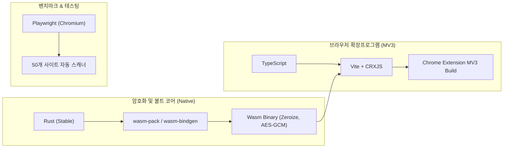

# 기술 스택, 빌드 파이프라인 및 구현 로드맵

## 1. 확정 기술 스택 및 도구 체인

| 계층 | 기술 스택 | 선정 이유 및 핵심 역할 |
| :--- | :--- | :--- |
| **Crypto Core (Wasm)** | **Rust** (`wasm-pack`) | GC 없는 런타임, 선형 메모리 기반 `zeroize` 강제 소거, 검증된 암호화 라이브러리(`aes-gcm`, `hkdf`, `sha2`) 활용 |
| **Extension Shell** | **TypeScript**, **Vite** | Chrome Manifest V3(Service Worker, Content Script) 환경의 타입 안정성 및 모듈 번들링 |
| **Auth Interface** | **WebAuthn PRF API** | 하드웨어 TPM 2.0 / OS Authenticator 연동 256비트 대칭키 도출 (서버리스 Zero-Trust) |
| **Data Storage** | `chrome.storage.local` | 암호화된 볼트 Blob(Ciphertext + Salt + IV + Tag) 로컬 영구 보관 |
| **Benchmark Bot** | **Python / Playwright** | 헤드리스 브라우저 기반 50대 레거시 웹사이트 DOM 구조 및 보안 솔루션 탐지 자동화 |

---

## 2. 단계별 구현 마일스톤 (Milestones)

### Phase 1: Rust Wasm 암호화 코어 및 WebAuthn PRF 검증
* **목표**: 하드웨어 키에서 유도한 PRF 대칭키로 볼트를 암복호화하고 민감 메모리를 안전하게 비우는 Wasm 모듈 완성.
* **세부 작업**:
  1. `crypto-core` Rust 라이브러리 작성:
     * `aes-gcm` 256비트 암복호화 로직 구현.
     * `zeroize` 트레이트를 활용한 메모리 소거 메커니즘 검증.
     * `wasm-pack` 타깃 빌드 파이프라인 구성.
  2. WebAuthn PRF 프로토타입 작성:
     * 브라우저 컨텍스트에서 `navigator.credentials.create()` 및 `get()` PRF Extension 동작 검증.
     * TPM 유도 32바이트 키 $\rightarrow$ HKDF $\rightarrow$ AES-GCM 복호화 파이프라인 연동 테스트.

### Phase 2: Chrome Extension MV3 셸 및 스토리지 구축
* **목표**: 확장프로그램 UI에서 볼트 생성, 잠금 해제, 계정 목록 CRUD 파이프라인 구현.
* **세부 작업**:
  1. MV3 Service Worker 및 Popup/Options 페이지 구성.
  2. Wasm 모듈을 Web Worker 또는 Extension Page로 임포트해 비동기 암복호화 처리.
  3. `chrome.storage.local` 연동: 버전 메타데이터, Salt, Nonce, 암호문 직렬화 저장.

### Phase 3: Content Script DOM 탐지 및 폼 제어 파이프라인
* **목표**: 웹페이지 내 폼 필드 식별, 비밀번호 자동 생성 및 주입 엔진 구현.
* **세부 작업**:
  1. **휴리스틱 폼 분석기**:
     * `input[type="password"]`, `autocomplete="current-password"`, `name/id` 정규식 기반 탐지.
     * 비밀번호 제약(maxLength, pattern) 추출 엔진 구현.
  2. **정책 기반 비밀번호 생성기 (CSPRNG)**:
     * 사이트별 허용 문자셋 및 길이 제약 안에서 최대 엔트로피 문자열 자동 생성.
  3. **주입 및 격리 정책**:
     * 주입 직후 메모리 참조 해제, 가상 키패드 및 보안 프로그램 간섭 감지 시 즉시 작업 중단 및 사용자 안내.

### Phase 4: 50대 레거시 사이트 벤치마크 및 데이터셋 수집
* **목표**: 50개 도메인을 스캔해 정량 지표를 측정하고 실태 분석 보고서 도출.
* **세부 작업**:
  1. Playwright 기반 자동 스캐너 스크립트 작성 (`scanner/crawl.py`).
  2. 50개 사이트 로그인/회원가입 페이지의 DOM 속성 및 보안 솔루션 탐지 자동 실행.
  3. Shannon Entropy 손실률 및 가상 키패드 차단율 데이터 집계 및 분석 리포트 생성.

---

## 3. 검증 및 테스트 계획

### 3.1 단위 테스트 (Unit Tests)
* **Rust Crypto Core**:
  * NIST CAVP 테스트 벡터 기반 AES-256-GCM 암복호화 검증.
  * 복호화 실패 시(Tag 불일치, Nonce 변조) 에러 핸들링 무결성 확인.
* **Entropy 계산기**:
  * 입력 길이 및 문자셋에 따른 Shannon Entropy 산출 로직 검증.

### 3.2 통합 및 E2E 테스트 (Integration & E2E)
* **WebAuthn 가상 환경 테스트**:
  * Playwright의 CDP(Chrome DevTools Protocol) 가상 인증자(`WebAuthn.enable`, `WebAuthn.addVirtualAuthenticator`)를 활용해 CI 환경에서 생체인증/PIN 통과 시나리오 자동화.
* **실제 웹사이트 호환성 테스트**:
  * 표준 폼 사이트(GitHub, Naver 등)와 가상 키패드 강제 사이트(은행/공공) 간 동작 비교 검증.
