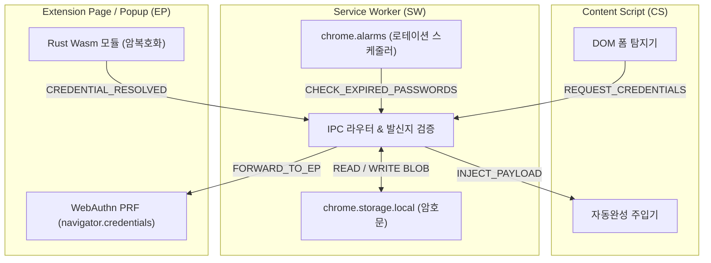

# Chrome MV3 Manifest 최소 권한 및 내부 IPC 메시지 패싱 명세

## 1. 개요

본 문서는 PrfVault 브라우저 확장프로그램(Chrome Manifest V3)의 최소 권한(Least Privilege) `manifest.json` 선언과 3개 실행 컨텍스트(Content Script, Service Worker, Extension Page) 간의 IPC 메시지 통신 규격 및 TypeScript 스키마를 정의한다.



---

## 2. Chrome MV3 `manifest.json` 최소 권한 명세

브라우저 확장프로그램의 과도한 권한은 공급망 공격 및 악성 익스플로잇의 1차 표적이 된다. 최소 권한 원칙(Principle of Least Privilege)에 따라 선언을 엄격히 통제한다.

### 2.1 완전한 `manifest.json` 선언

```json
{
  "manifest_version": 3,
  "name": "PrfVault",
  "version": "1.0.0",
  "description": "Zero-Server WebAuthn PRF Hardware-Bound Password Vault",
  "icons": {
    "16": "icons/icon-16.png",
    "48": "icons/icon-48.png",
    "128": "icons/icon-128.png"
  },
  "action": {
    "default_popup": "src/ui/popup.html",
    "default_icon": {
      "16": "icons/icon-16.png",
      "48": "icons/icon-48.png"
    }
  },
  "background": {
    "service_worker": "src/background/service-worker.ts",
    "type": "module"
  },
  "permissions": [
    "storage",
    "alarms",
    "activeTab",
    "scripting"
  ],
  "host_permissions": [
    "https://*/*"
  ],
  "content_scripts": [
    {
      "matches": ["https://*/*"],
      "js": ["src/content/index.ts"],
      "run_at": "document_idle",
      "all_frames": false
    }
  ],
  "content_security_policy": {
    "extension_pages": "script-src 'self' 'wasm-unsafe-eval'; object-src 'self'"
  },
  "web_accessible_resources": []
}
```

### 2.2 권한 산정 이유 및 제외 항목

| 권한 항목 | 필수 이유 | 최소화 및 격리 방침 |
| :--- | :--- | :--- |
| `storage` | 암호화된 볼트 바이너리(`chrome.storage.local`) 영구 저장 | 평문 비밀번호 및 대칭키는 스토리지에 절대 기록하지 않음. |
| `alarms` | Service Worker 유휴 종료 대응 비밀번호 로테이션 만료 검사 | `setInterval`은 SW가 수십 초 내 종료되므로 동작 불가. `chrome.alarms`를 통한 간헐적 웨이크업 필수. |
| `activeTab` | 사용자가 툴바 아이콘 클릭 시 현재 탭에 대한 임시 권한 획득 | 광범위한 브라우징 히스토리(`tabs`) 권한 배제. |
| `scripting` | 특정 로그인 iframe 내 정밀 폼 보조 주입 | 전역 실행 권한 대신 타깃 탭 ID 기반으로만 실행. |
| `host_permissions` | 사용자가 접속하는 임의의 HTTPS 사이트에서 폼 감지 필요 | 보안상 평문 HTTP 통신(`http://*/*`)은 제외하고 `https://*/*`로 한정. |

* **배제된 위험 권한**:
  * `<all_urls>`: Web Store 심사 거부 사유이자 과도한 권한이므로 배제.
  * `cookies`, `webRequest`: 네트워크 트래픽 가로채기 권한 전면 배제 (Zero-Server 및 신뢰 경계 준수).
  * `web_accessible_resources`: 웹페이지가 확장 내부 HTML/JS 리소스를 로드해 지문(Fingerprinting)을 채취하거나 침투하는 경로 차단 (`[]` 빈 배열).
* **CSP `'wasm-unsafe-eval'` 필수 사유**:
  * Rust 컴파일 결과물인 Wasm 모듈을 V8 엔진에서 인스턴스화(`WebAssembly.instantiateStreaming`)하려면 MV3 CSP에서 `'wasm-unsafe-eval'` 명시가 필수적임 (W3C/Chrome MV3 스펙).

---

## 3. 실행 컨텍스트 간 역할 및 신뢰 경계 (Trust Boundaries)

| 컨텍스트 | 실행 환경 | 접근 가능 자원 | 엄격한 제약 사항 |
| :--- | :--- | :--- | :--- |
| **Content Script (CS)** | 웹페이지 Isolated World | 페이지 DOM, `chrome.runtime.sendMessage` | 1. 볼트 스토리지 및 Wasm 접근 불가<br/>2. WebAuthn 호출 불가<br/>3. 평문 자격증명은 주입 후 즉시 참조 해제 |
| **Service Worker (SW)** | Chrome Background Worker | `chrome.storage.local`, `chrome.alarms`, IPC 브로커 | 1. Window 객체 부재로 `navigator.credentials`(WebAuthn) 호출 불가<br/>2. 유휴 시 30초 내 프로세스 종료되므로 메모리에 마스터키 캐싱 절대 금지 |
| **Extension Page (EP)** | Chrome Popup / Vault Tab (Window Context) | WebAuthn API, Wasm 런타임, 선형 메모리 | 1. 사용자 생체인증 제스처 처리<br/>2. 복호화 작업 완료 후 Wasm 선형 메모리 `zeroize` 강제 실행 |

---

## 4. 내부 IPC 메시지 패싱 프로토콜 규격

### 4.1 메시지 통신 기본 엔벨로프 (Envelope)

모든 IPC 통신은 비동기 Request-Response 패턴(`chrome.runtime.sendMessage`)으로 수행하며 일관된 엔벨로프 형식을 강제한다.

```typescript
// 공통 요청 엔벨로프
export interface IpcRequest<TAction extends string, TPayload> {
  id: string;              // UUID v4 (요청-응답 추적용)
  action: TAction;
  payload: TPayload;
  timestamp: number;       // Unix epoch ms
}

// 공통 성공 응답
export interface IpcSuccessResponse<TData> {
  id: string;              // 요청 id와 일치
  success: true;
  data: TData;
}

// 공통 실패 응답
export interface IpcErrorResponse {
  id: string;              // 요청 id와 일치
  success: false;
  error: {
    code: IpcErrorCode;
    message: string;
    details?: unknown;
  };
}

export type IpcResponse<TData> = IpcSuccessResponse<TData> | IpcErrorResponse;
```

### 4.2 에러 코드 정의 (`IpcErrorCode`)
```typescript
export type IpcErrorCode =
  | 'UNAUTHORIZED_SENDER'       // 확장프로그램 외부 또는 위조된 도메인 요청
  | 'VAULT_LOCKED'              // 볼트가 잠겨 있어 자격증명 복호화 불가
  | 'NO_CREDENTIALS_FOUND'      // 해당 도메인에 등록된 계정 없음
  | 'HARDWARE_AUTH_FAILED'      // WebAuthn 생체인증 실패 또는 사용자 취소
  | 'WASM_DECRYPTION_FAILED'    // AES-GCM 복호화 또는 태그 불일치
  | 'SECURITY_MODULE_BLOCKED'   // 가상 키패드 또는 E2E 암호화 감지로 주입 중단
  | 'STORAGE_ERROR'             // chrome.storage.local 읽기/쓰기 장애
  | 'INVALID_REQUEST_PAYLOAD';  // 스키마 유효성 검증 실패
```

---

## 5. 상세 IPC 액션 인터페이스 (TypeScript)

### 5.1 Content Script <-> Service Worker

#### 1) `CS_DETECT_SECURITY_MODULE`
* **방향**: CS $\rightarrow$ SW
* **목적**: 페이지 내 가상 키패드, TouchEn, ASTx 등 보안 솔루션 존재 여부 보고 (통계 수집 및 자동완성 차단).
```typescript
export interface CsDetectSecurityModulePayload {
  domain: string;
  hasVirtualKeypad: boolean;
  hasE2EKeyboardModule: boolean;
  detectedSelectors: string[];
}

export type CsDetectSecurityModuleResponse = IpcResponse<{
  allowAutofill: boolean;
}>;
```

#### 2) `CS_REQUEST_CREDENTIALS`
* **방향**: CS $\rightarrow$ SW
* **목적**: 폼 포커스 시 현재 활성 탭에 바인딩된 계정 정보 요청. (도메인 스푸핑 방지를 위해 CS는 도메인 문자열을 직접 지정할 수 없으며, SW가 `sender.tab.url`에서 eTLD+1을 직접 파싱함).
```typescript
export interface CsRequestCredentialsPayload {
  formId?: string;
  isPasswordChangeForm: boolean;
}

export interface CredentialCandidate {
  accountId: string;
  username: string;
  password?: string;            // 볼트 잠금 해제 상태일 때만 평문 전달
}

export type CsRequestCredentialsResponse = IpcResponse<{
  domain: string;               // SW가 검증한 eTLD+1 도메인
  isVaultLocked: boolean;
  candidates: CredentialCandidate[];
}>;
```

#### 3) `CS_REPORT_INJECTION_RESULT`
* **방향**: CS $\rightarrow$ SW
* **목적**: DOM 값 주입 결과 및 키 입력 간격 감지 여부 감사 로그 보고.
```typescript
export interface CsReportInjectionResultPayload {
  domain: string;
  accountId: string;
  status: 'SUCCESS' | 'BLOCKED_BY_KEYPAD' | 'DOM_INPUT_REJECTED';
  interKeystrokeMs: number;
}

export type CsReportInjectionResultResponse = IpcResponse<void>;
```

---

### 5.2 Service Worker <-> Extension Page (Popup / Options)

#### 1) `EP_GET_VAULT_STATUS`
* **방향**: EP $\rightarrow$ SW
* **목적**: 볼트 초기화 여부, 현재 잠금 여부, 등록된 계정 개수 확인.
```typescript
export interface EpGetVaultStatusPayload {}

export interface EpGetVaultStatusData {
  isInitialized: boolean;        // 최초 WebAuthn 등록 완료 여부
  isLocked: boolean;             // 현재 메모리 내 마스터키 활성화 여부
  credentialId?: string;         // WebAuthn Credential ID (Base64URL)
  salt?: string;                 // Hex 인코딩된 32바이트 솔트
  accountCount: number;
}

export type EpGetVaultStatusResponse = IpcResponse<EpGetVaultStatusData>;
```

#### 2) `EP_UNLOCK_VAULT`
* **방향**: EP $\rightarrow$ SW
* **목적**: EP에서 WebAuthn PRF 출력과 Wasm으로 복호화된 JSON 볼트를 SW의 임시 캐시 세션에 주입.
* **보안 주의**: SW가 수면(Terminate) 상태에 들어가면 해당 세션은 소멸해야 하므로 `sessionStorage` 또는 SW 수명 범위 내 객체로만 한정.
```typescript
export interface EpUnlockVaultPayload {
  decryptedAccountsSummary: Array<{
    id: string;
    domain: string;
    username: string;
  }>;
}

export type EpUnlockVaultResponse = IpcResponse<{
  unlockedAt: number;
  sessionTtlMs: number;
}>;
```

#### 3) `EP_SAVE_ENCRYPTED_VAULT`
* **방향**: EP $\rightarrow$ SW
* **목적**: 계정 추가/수정 또는 비밀번호 로테이션 후 EP의 Wasm 코어가 새로 암호화한 바이너리 Blob을 로컬 스토리지에 저장.
```typescript
export interface EpSaveEncryptedVaultPayload {
  encryptedBlobHex: string;      // Base64URL 또는 Hex 인코딩된 바이너리
  schemaVersion: number;
}

export type EpSaveEncryptedVaultResponse = IpcResponse<{
  bytesWritten: number;
  updatedAt: string;
}>;
```

---

## 6. 보안 검증 및 발신지 위조 방지 규칙 (Zero-Trust Origin Verification)

단순한 `senderUrl.hostname.endsWith(domain)` 문자열 비교는 `fake-kbstar.com` 또는 서브도메인 경계 누락 공격에 뚫리는 치명적 결함이 있다.

따라서 Service Worker는 CS가 전송한 임의의 도메인 파라미터를 일체 신뢰하지 않으며, **브라우저 커널이 인증한 `sender.tab.url`에서 Public Suffix List(PSL) 기반으로 eTLD+1을 직접 산출하여 볼트 쿼리 키로 강제 적용**한다.

```typescript
import { getDomain } from 'tldts'; // Public Suffix List 기반 eTLD+1 추출 엔진

chrome.runtime.onMessage.addListener((message: IpcRequest<string, unknown>, sender, sendResponse) => {
  // 1. 발신자 확장프로그램 런타임 ID 검증 (타 악성 확장프로그램 침투 방어)
  if (sender.id !== chrome.runtime.id) {
    sendResponse({
      id: message.id,
      success: false,
      error: { code: 'UNAUTHORIZED_SENDER', message: 'Mismatched runtime ID' }
    });
    return false;
  }

  // 2. Content Script로부터의 도메인 스푸핑 원천 차단
  let verifiedDomain: string | null = null;
  if (sender.tab && sender.tab.url) {
    const parsedUrl = new URL(sender.tab.url);
    
    // HTTP/HTTPS 오리진만 허용 (chrome://, file://, javascript: 배제)
    if (!['http:', 'https:'].includes(parsedUrl.protocol)) {
      sendResponse({
        id: message.id,
        success: false,
        error: { code: 'UNAUTHORIZED_SENDER', message: 'Invalid origin protocol' }
      });
      return false;
    }

    // eTLD+1 추출 (예: "login.kbstar.com" -> "kbstar.com", "fake.kbstar.com.phishing.com" -> "phishing.com")
    verifiedDomain = getDomain(parsedUrl.hostname);
    if (!verifiedDomain) {
      sendResponse({
        id: message.id,
        success: false,
        error: { code: 'UNAUTHORIZED_SENDER', message: 'Cannot resolve eTLD+1 from tab URL' }
      });
      return false;
    }
  }

  // 3. 비동기 라우터로 검증된 도메인 컨텍스트 주입 후 전달
  handleRouter(message, sender, verifiedDomain).then(sendResponse);
  return true;
});
```

---

### 6.1 런타임 페이로드 검증 (Runtime Schema Validation)

TypeScript의 정적 타입은 브라우저 런타임에 완전히 소멸(Type Erasure)되므로, `chrome.runtime.onMessage`로 유입되는 메시지는 잠재적 악성 데이터(`unknown`)다. 

공격자가 변조된 데이터나 비정상적 객체를 주입해 서비스 워커의 파싱 에러나 로직 결함을 찌르는 것을 차단하기 위해 **Zod 기반 런타임 스키마 검증**을 적용한다.

```typescript
import { z } from 'zod';

// CS_REQUEST_CREDENTIALS 런타임 스키마 정의
export const CsRequestCredentialsSchema = z.object({
  id: z.string().uuid(),
  action: z.literal('CS_REQUEST_CREDENTIALS'),
  payload: z.object({
    formId: z.string().max(128).optional(),
    isPasswordChangeForm: z.boolean()
  }).strict(), // 정의되지 않은 임의의 속성 주입 원천 차단 (Prototype Pollution 방어)
  timestamp: z.number().int().positive()
});

// 핸들러 진입부 검증
export function validateIpcPayload<T>(schema: z.ZodType<T>, data: unknown): T {
  const result = schema.safeParse(data);
  if (!result.success) {
    throw new Error(`INVALID_REQUEST_PAYLOAD: ${result.error.message}`);
  }
  return result.data;
}
```

* **방어되는 공격 유형**:
  1. **프로토타입 오염 (Prototype Pollution)**: `z.strict()`를 선언해 `__proto__`, `constructor` 등이 포함된 악성 객체 주입 시 파싱 단계에서 즉시 드롭.
  2. **메모리 고갈 DoS**: 문자열 필드마다 `max(128)`, `max(1024)` 등 엄격한 바이트 상한을 강제해 거대 페이로드 전송으로 인한 V8 힙 고갈 방어.
  3. **Rust Wasm 경계 방어**: Wasm FFI 호출 전 버퍼 크기($L_c \ge 66$)와 널 포인터 여부를 TS 계층에서 1차 검증하고, Rust 계층에서 2차 바운드 체크(`slice.get().ok_or(ERR_INVALID_PAYLOAD_LEN)`)를 수행해 Wasm 런타임 패닉(Panic) 방어.

---

### 6.2 트러블슈팅 기록: `endsWith()` 서브도메인 경계 우회 취약점

* **발견된 결함 (Vulnerability)**:
  - 초기 설계: `senderUrl.hostname.endsWith(payload.domain)` 형태로 단순 접미사 대조 수행.
  - 우회 경로:
    1. **유사 도메인 접미사 스푸핑**: `payload.domain = "kbstar.com"`일 때 공격자가 `fake-kbstar.com` 또는 `attacker-kbstar.com`을 등록하면 `endsWith("kbstar.com")`가 `true`로 평가되어 은행 자격증명이 공격자 사이트로 누출됨.
    2. **서브도메인 계층 역전**: `payload.domain = "attacker.com"`일 때 `kbstar.com.attacker.com`과 같은 다단계 서브도메인에서 도메인 경계(Dot `.`) 누락으로 인한 오탐 발생.
* **원인 분석 (Root Cause)**:
  - 비신뢰 영역인 Content Script가 요청 도메인(`payload.domain`)을 능동적으로 지정할 수 있도록 허용한 설계 결함.
  - 정규화되지 않은 단순 문자열 접미사 비교로 인한 도메인 경계 미인식.
* **해결 조치 (Resolution)**:
  1. **CS 페이로드 수정**: `CS_REQUEST_CREDENTIALS` 페이로드에서 `domain` 필드를 완전 제거.
  2. **단일 신뢰 원천(SSOT) 확립**: Service Worker가 브라우저 커널이 인증한 `sender.tab.url`만을 유일한 입력으로 채택.
  3. **eTLD+1 엔진 도입**: 단순 파싱 대신 Public Suffix List(PSL) 표준 라이브러리(`tldts`)의 `getDomain()`을 적용해 유효 등록 도메인을 분리 추출하여 볼트 검색 키로 강제 매핑.

