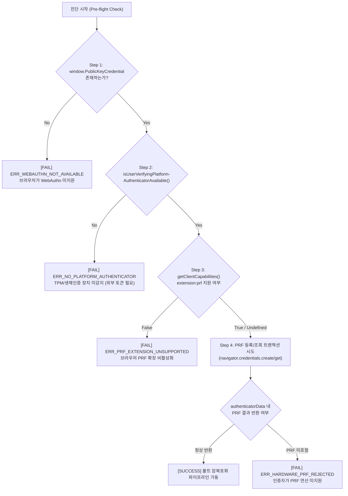

# WebAuthn PRF 호환성 감지 및 예외 처리 흐름도

## 1. 개요

PrfVault는 중앙 서버 없이 사용자 기기의 하드웨어 보안 모듈(TPM 2.0 / Secure Enclave)과 W3C WebAuthn Level 3 PRF(Pseudo-Random Function) 확장에 대칭키 생성을 100% 위임한다. 

따라서 클라이언트 환경이 PRF 확장을 지원하지 않거나 하드웨어 인증자가 비활성화된 경우, **취약한 소프트웨어 키로 우회(Bypass)하지 않고 볼트 생성을 안전하게 차단(Fail-Closed)한 뒤 명확한 복구 경로를 안내하는 엄격한 예외 처리 파이프라인**이 필수적이다.

---

## 2. 하드웨어 및 소프트웨어 스택 요구사항

WebAuthn PRF 확장이 정상 동작하기 위해서는 브라우저, OS 인증자, 물리 칩셋의 3개 계층이 모두 요구 조건을 충족해야 한다.

```
+-----------------------------------------------------------------------+
| 브라우저 계층  : Chromium 116+ (W3C WebAuthn Level 3 PRF 지원)          |
+-----------------------------------------------------------------------+
| OS/API 계층   : Windows 10/11 22H2+ (Windows Hello API)               |
|                 macOS 13+ Ventura (LocalAuthentication / Data Prot.)  |
+-----------------------------------------------------------------------+
| 하드웨어 계층  : TPM 2.0 (dTPM / fTPM 활성화)                           |
|                 Apple Secure Enclave (T2 / Apple Silicon)             |
|                 외부 FIDO2 v2.1 토큰 (YubiKey 5 Series FW 5.2.3+)     |
+-----------------------------------------------------------------------+
```

---

## 3. 사전 진단 파이프라인 (Pre-flight Diagnostics)

볼트 생성(`Registration`) 및 잠금 해제(`Authentication`) 전, 확장프로그램 UI는 4단계 점진적 진단을 실행한다.



### 진단 단계별 판정 로직

1. **Step 1: WebAuthn 전역 API 존재 여부**
   * 검증: `'PublicKeyCredential' in window`
   * 실패 시: Chrome 브라우저 버전이 지나치게 낮거나 보안 컨텍스트(`isSecureContext === false`)가 아님.
2. **Step 2: 플랫폼 인증자 가용성 검증**
   * 검증: `await PublicKeyCredential.isUserVerifyingPlatformAuthenticatorAvailable()`
   * 실패 시: Windows Hello 미설정, TPM 비활성화, 또는 가상 머신 환경.
3. **Step 3: 클라이언트 기능 지원 검증**
   * 검증: `await PublicKeyCredential.getClientCapabilities?.()` 호출 후 `capabilities['extension:prf'] === true` 확인 (Chrome 128+ 표준). 구형 Chromium의 경우 `undefined`일 수 있으므로 Step 4의 실제 호출 결과로 폴백 검증.
4. **Step 4: 실제 하드웨어 PRF 연산 검증**
   * 검증: 등록 시 `credential.getClientExtensionResults().prf.enabled === true`, 인증 시 `credential.getClientExtensionResults().prf.results.first`가 32바이트 `ArrayBuffer`로 반환되는지 확인.

---

## 4. 런타임 예외 및 DOMException 매핑

WebAuthn API 호출 중 발생 가능한 `DOMException`과 PrfVault 내부 상태 코드 매핑 테이블:

| DOMException Name | 발생 원인 | PrfVault 내부 코드 | 처리 정책 |
| :--- | :--- | :--- | :--- |
| `NotSupportedError` | 브라우저 또는 인증자가 PRF 확장을 해석할 수 없음 | `PRF_EXTENSION_NOT_SUPPORTED` | **Fail-Closed**: 볼트 생성 중단, 호환 기기/브라우저 안내 |
| `NotAllowedError` | 1. 사용자가 Windows Hello 프롬프트 취소<br/>2. 생체/PIN 입력 시도 횟수 초과<br/>3. 인증 타임아웃 | `USER_CANCELLED_OR_TIMEOUT` | **Retry Allowed**: 볼트 상태 유지, "인증이 취소되었습니다. 다시 시도하십시오." 안내 |
| `InvalidStateError` | 등록 시 이미 동일한 기기 키가 등록되어 있거나 파라미터 충돌 | `CREDENTIAL_ALREADY_EXISTS` | **Re-sync**: 기존 Credential ID 무효화 후 재등록 유도 |
| `ConstraintError` | `userVerification: "required"` 조건을 기기가 충족하지 못함 (PIN 미설정) | `USER_VERIFICATION_UNAVAILABLE` | **Action Required**: OS 설정에서 Windows Hello PIN/지문 등록 요구 |
| `SecurityError` | 보안되지 않은 오리진 또는 잘못된 RP ID | `INVALID_RP_CONFIGURATION` | **Fatal**: 내부 설정 오류 리포트 |

---

## 5. Fail-Closed 원칙 및 복구 안내 프로토콜

### 5.1 비우회 원칙에 따른 Fail-Closed 정책
* **PBKDF2 / 패스워드 우회 금지**: 하드웨어 키 생성이 실패했을 때 소프트웨어 마스터 패스워드로 암호화 방식을 완화하지 않는다. 이는 Zero-Server 로컬 볼트의 '하드웨어 격리 불변성'을 훼손하기 때문이다.
* **데이터 보존 원칙**: 잠금 해제 중 PRF 유도가 실패하더라도 로컬 스토리지의 암호문(`chrome.storage.local`)은 절대 삭제하거나 덮어쓰지 않는다.

### 5.2 사용자 환경 복구 가이드 상태 머신

```mermaid
stateDiagram-v2
    [*] --> DIAGNOSE
    
    state DIAGNOSE {
        DIAGNOSE --> NO_TPM: TPM 2.0 미검출
        DIAGNOSE --> NO_PIN: Windows Hello / TouchID 미설정
        DIAGNOSE --> OLD_BROWSER: Chrome 버전 < 116
        DIAGNOSE --> READY: 하드웨어/소프트웨어 적격
    }

    NO_TPM --> GUIDE_BIOS: 메인보드 BIOS/UEFI에서 fTPM/dTPM 활성화 가이드 안내
    NO_PIN --> GUIDE_OS_SETTINGS: OS 설정 > 로그인 옵션에서 PIN/생체인증 등록 안내
    OLD_BROWSER --> GUIDE_UPDATE: 브라우저 최신 버전 업데이트 링크 제공

    GUIDE_BIOS --> DIAGNOSE: 재검사
    GUIDE_OS_SETTINGS --> DIAGNOSE: 재검사
    GUIDE_UPDATE --> DIAGNOSE: 재검사

    READY --> VAULT_OPERATIONAL: 볼트 생성 및 잠금 해제 진행
```

---

## 6. TypeScript 사전 진단 구현 명세 (`prf-diagnostics.ts`)

```typescript
export type PrfDiagnosticStatus = 
  | 'SUPPORTED'
  | 'ERR_NOT_SECURE_CONTEXT'
  | 'ERR_WEBAUTHN_NOT_AVAILABLE'
  | 'ERR_NO_PLATFORM_AUTHENTICATOR'
  | 'ERR_PRF_EXTENSION_UNSUPPORTED';

export interface PrfDiagnosticResult {
  status: PrfDiagnosticStatus;
  details: {
    isSecureContext: boolean;
    hasWebAuthn: boolean;
    hasPlatformAuth: boolean;
    hasPrfCapability: boolean;
    userAgent: string;
  };
}

export async function checkWebAuthnPrfSupport(): Promise<PrfDiagnosticResult> {
  const details = {
    isSecureContext: window.isSecureContext,
    hasWebAuthn: 'PublicKeyCredential' in window,
    hasPlatformAuth: false,
    hasPrfCapability: false,
    userAgent: navigator.userAgent
  };

  if (!details.isSecureContext) {
    return { status: 'ERR_NOT_SECURE_CONTEXT', details };
  }

  if (!details.hasWebAuthn) {
    return { status: 'ERR_WEBAUTHN_NOT_AVAILABLE', details };
  }

  try {
    details.hasPlatformAuth = await PublicKeyCredential.isUserVerifyingPlatformAuthenticatorAvailable();
  } catch {
    details.hasPlatformAuth = false;
  }

  if (!details.hasPlatformAuth) {
    return { status: 'ERR_NO_PLATFORM_AUTHENTICATOR', details };
  }

  // Chrome 128+ getClientCapabilities 확인
  if (typeof PublicKeyCredential.getClientCapabilities === 'function') {
    try {
      const caps = await PublicKeyCredential.getClientCapabilities();
      details.hasPrfCapability = caps['extension:prf'] === true;
    } catch {
      details.hasPrfCapability = false;
    }
  } else {
    // getClientCapabilities 미지원 시 Chromium 116+ 기반 추정 (실제 create/get 시 최종 검증)
    const chromiumMatch = navigator.userAgent.match(/Chrome\/(\d+)/);
    const majorVersion = chromiumMatch ? parseInt(chromiumMatch[1], 10) : 0;
    details.hasPrfCapability = majorVersion >= 116;
  }

  if (!details.hasPrfCapability) {
    return { status: 'ERR_PRF_EXTENSION_UNSUPPORTED', details };
  }

  return { status: 'SUPPORTED', details };
}
```
