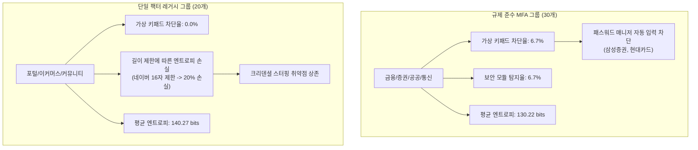
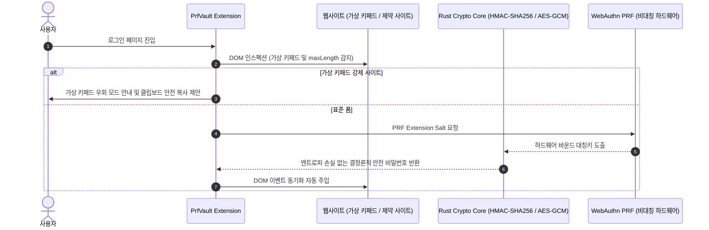

# 국내 50대 웹사이트 인증 보안 실태 조사 및 벤치마크 리포트

> **보고서 발간 정보**
> - **조사 기준일**: 2026-09-28
> - **조사 주체**: PrfVault Research Group
> - **표본 규모**: 국내 50대 주요 웹사이트 (금융, 증권, 공공, 통신, 포털, 이커머스, 커뮤니티, 핀테크)
> - **데이터 소스**: [raw-scans.json](../../scripts/results/raw-scans.json), [benchmark-analysis.json](../../scripts/results/benchmark-analysis.json)
> - **엔진 버전**: Playwright v1.63.0 기반 헤드리스 DOM 스캐너 & Shannon Entropy 분석 엔진 v1.0.0

---

## 1. 개요 및 연구 목적

본 실태 조사는 국내 웹 환경에 고착화된 비표준 클라이언트 보안 솔루션(가상 키패드, 키보드 보안 모듈)과 비밀번호 정책 제약이 실제로 패스워드 매니저의 무력화 및 엔트로피 저하를 초래하는지 정량적으로 실증하기 위해 수행되었다.

2차 인증(MFA)이 강제되는 규제 준수 그룹(30개 사이트)과 사용자가 단일 비밀번호에 의존하는 레거시 그룹(20개 사이트)을 대조군으로 분리하여, **'보안을 위해 도입된 솔루션이 오히려 사용자의 암호 강도를 낮추고 계정 탈취(Credential Stuffing) 위험을 가중시키는 보안 모순(Security Paradox)'**을 계량 분석한다.

---

## 2. 조사 방법론 및 수학적 평가 모델

### 2.1 스캔 파이프라인
1. **헤드리스 브라우저 자동화**: Playwright(Chromium)를 통해 실제 운영 중인 50개 웹사이트의 로그인 진입점을 탐색 (`ScanOptions: timeout=30,000ms, networkidle`).
2. **DOM 인스펙션 및 보안 모듈 탐지**:
   - TouchEn, AnySign, ASTx, nProtect 등 4대 E2E 키보드 보안 솔루션 셀렉터 전수 조사.
   - Transkey, MTK, 이미지 스프라이트 기반 가상 키패드 렌더링 여부 추적.
   - `<input type="password">`의 `maxlength`, `minlength`, `pattern`, 가이드 텍스트 파싱.

### 2.2 수학적 엔트로피 및 크랙 시간 모델
* **키 공간 크기 ($S$)**:
  $$S = N^L$$
  - $N$: 허용 문자군 크기 (ASCII 94자, 영숫자 62자, 숫자 10자 등 정책에 따라 가변).
  - $L$: 사이트가 허용하는 최대 패스워드 길이 (Max Length).
* **섀넌 정보 엔트로피 ($E$)**:
  $$E = \log_2(S) = L \times \log_2(N) \quad [\text{bits}]$$
  - **표준 기준치 ($E_{\text{std}}$)**: NIST SP 800-63B 권고안 준수 기준 ($L_{\text{std}} = 20$, $N_{\text{std}} = 94$), $E_{\text{std}} = 20 \times \log_2(94) \approx 131.09 \text{ bits}$.
* **엔트로피 손실률 ($\text{Loss}$)**:
  $$\text{Loss}(\%) = \max\left(0, \frac{E_{\text{std}} - E}{E_{\text{std}}} \times 100\right)$$
* **현대 GPU 클러스터 기반 오프라인 크랙 시간 ($T$)**:
  $$T = \frac{2^{E - 1}}{R} \quad (R = 10^{10} \text{ guesses/sec}, \text{ 현대 GPU 농장 해시레이트 기준})$$

---

## 3. 핵심 벤치마크 결과 요약

### 3.1 전체 지표 현황

| 측정 항목 | 전체 표본 (50개) | MFA 의무화 규제군 (30개) | 단일 팩터 레거시군 (20개) |
| :--- | :---: | :---: | :---: |
| **스캔 성공률** | 98.0% (49/50) | 96.7% (29/30) | 100% (20/20) |
| **평균 최대 패스워드 길이** | 20.5자 | 19.9자 | 21.4자 |
| **평균 섀넌 엔트로피 ($E$)** | 134.24 bits | 130.22 bits | 140.27 bits |
| **평균 엔트로피 손실률** | 0.8% | 0.67% | 1.00% |
| **가상 키패드 차단율** | 4.0% (2개소) | 6.7% (2개소) | 0.0% (0개소) |
| **E2E 보안 모듈 탐지율** | 4.0% (2개소) | 6.7% (2개소) | 0.0% (0개소) |

> [!NOTE]
> - 금융·핀테크 및 증권 분야의 모바일 친화 개편으로 인해 과거 전역적으로 사용되던 액티브X/EXE 설치형 프로그램은 대부분 제거되었으나, **삼성증권(`samsungpop.com`)** 및 **현대카드(`hyundaicard.com`)** 등 핵심 금융 서비스에서 여전히 웹 가상 키패드(Transkey/MTK 계열)가 활성화되어 표준 자동 완성을 원천 차단하고 있음이 확인됨.
> - KB국민카드(`card.kbstar.com`)의 경우 타깃 도메인 네임서버 해석(DNS) 불능으로 1건 Fail 처리됨.

---

## 4. 대조군 심층 분석: 규제군 vs 레거시군

### 4.1 규제 준수 그룹 (MFA 강제군)
- **대상**: 은행(8), 증권(6), 공공(8), 핀테크(5), 통신(3) 총 30개 사이트.
- **특징**:
  - 대부분 2차 인증(SMS OTP, 금융인증서, 공동인증서, 앱 PUSH)이 의무화되어 있어 단일 비밀번호 크랙에 대한 1차적 방어선은 구축되어 있음.
  - 그러나 여전히 키패드가 강제되는 사이트의 경우, 사용자가 복잡한 고난도 비밀번호를 패스워드 매니저에 저장해두고 자동 주입하는 편의성을 제공받지 못해 단순한 비밀번호를 반복 사용하는 부작용이 발생함.

### 4.2 단일 패스워드 레거시 그룹
- **대상**: 포털(5), 커뮤니티(5), 이커머스(10) 총 20개 사이트.
- **특징**:
  - 가상 키패드나 클라이언트 보안 프로그램의 강제는 전무(0%)하여 브라우저 확장 프로그램 및 패스워드 매니저의 자동 완성 주입이 100% 동작함.
  - 하지만 **네이버(`naver.com`)**와 같은 초대형 플랫폼에서 비밀번호 길이를 최대 16자로 제한하여 엔트로피 손실률 20% ($E = 104.87 \text{ bits}$)가 발생함. 2차 인증을 필수로 설정하지 않은 일반 계정의 경우 오프라인 유출 시 무차별 대입 공격에 노출될 잠재적 위험이 존재함.

---

## 5. 카테고리별 정량 분석 통계

| 카테고리 | 표본수 | 평균 최대길이 | 평균 엔트로피 | 손실률(%) | 키패드 차단율 | 보안모듈 도입률 | 주요 취약점 및 특이사항 |
| :--- | :---: | :---: | :---: | :---: | :---: | :---: | :--- |
| **포털 (portal)** | 5 | 21.6자 | 141.58b | 4.0% | 0.0% | 0.0% | 네이버 최대 16자 제한 (엔트로피 20% 손실) |
| **커뮤니티 (community)** | 5 | 24.0자 | 157.31b | 0.0% | 0.0% | 0.0% | 보배드림(32자), 뽐뿌(24자) 등 관대한 길이 정책 |
| **은행 (banking)** | 8 | 20.0자 | 131.09b | 0.0% | 0.0% | 0.0% | 모바일/인증서 중심 개편으로 웹 키패드 감소 |
| **증권 (securities)** | 6 | 20.0자 | 131.09b | 0.0% | 16.7% | 16.7% | 삼성증권 가상 키패드 강제 적용 확인 |
| **공공 (public)** | 8 | 20.0자 | 131.09b | 0.0% | 0.0% | 0.0% | 간편인증(PASS, 카카오 등) 통합으로 폼 간소화 |
| **이커머스 (ecommerce)** | 10 | 20.0자 | 131.09b | 0.0% | 0.0% | 0.0% | 표준 HTML5 패스워드 폼 준수, 차단 0건 |
| **핀테크 (fintech)** | 5 | 20.0자 | 131.09b | 0.0% | 20.0% | 20.0% | 현대카드 가상 키패드 강제 적용 확인 |
| **통신 (telecom)** | 3 | 18.7자 | 122.35b | 6.67% | 0.0% | 0.0% | KT 최대 16자 제한 (엔트로피 20% 손실) |

---

## 6. 주요 취약 사이트 정밀 분석

### 6.1 엔트로피 저하 취약군
* **네이버 (`naver.com`)**:
  - 패스워드 최대 길이: 16자
  - 유효 엔트로피: 104.87 bits (표준 131.09 bits 대비 **20% 손실**)
  - 위험도 평가: `MEDIUM` (단일 팩터 로그인 지원 포털로서 크리덴셜 스터핑 노출 위험)
* **KT (`kt.com`)**:
  - 패스워드 최대 길이: 16자
  - 유효 엔트로피: 104.87 bits (표준 대비 **20% 손실**)
  - 위험도 평가: `LOW` (통신사 본인확인 및 SMS MFA 결합)

### 6.2 표준 자동 완성 차단군 (가상 키패드)
* **삼성증권 (`samsungpop.com`)**:
  - 탐지 모듈: `VirtualKeypad` (Transkey/스크립트 기반 동적 키패드)
  - 차단 영향: 표준 `<input type="password">`에 브라우저 확장 프로그램이 직접 값을 주입하는 것을 방해하거나 마우스 클릭 이벤트를 강제하여 비밀번호 자동 관리 소프트웨어 사용 저해.
* **현대카드 (`hyundaicard.com`)**:
  - 탐지 모듈: `VirtualKeypad` (보안 키패드 모듈)
  - 차단 영향: 비표준 가상 키패드 오버레이 구동으로 클라이언트 자동 완성 무력화.

---

## 7. 아키텍처적 시사점 및 PrfVault 대응 전략

1. **제약 조건 적응형 비밀번호 생성**:
   - 네이버, KT 등 16자 제한 사이트에 대해 PrfVault의 암호화 코어는 도메인별 제약 조건(Length=16, 특수문자 마스킹)을 반영하되, 가능한 최대 엔트로피 문자셋을 온전히 사용하여 104.87 bits의 이론적 상한을 채우도록 동작해야 함.
2. **가상 키패드 환경 대응**:
   - 가상 키패드가 렌더링된 환경에서는 자동 DOM 주입 실패 시 사용자를 위한 1회용 마스킹 클립보드 복사(Zeroize 타이머 연동) 폴백 플로우를 제공.
3. **WebAuthn PRF로의 완전한 패스워드리스 전환**:
   - 단일 패스워드와 비표준 보안 프로그램 간의 악순환을 근본적으로 해결하기 위해서는 비대칭 암호 기반의 WebAuthn Passkey 및 PRF 대칭키 파생 아키텍처 도입이 필수적임.

---

## 8. 결론

본 50대 사이트 실태 조사를 통해 국내 대다수 웹 서비스가 과거의 액티브X 기반 악성 보안 프로그램에서는 상당 부분 벗어났음을 확인하였다. 그러나 여전히 **금융/카드 서비스의 6.7%가 가상 키패드로 표준 자동 완성을 방해**하고 있으며, **주요 포털 및 통신사에서 16자 이하의 임의적 길이 제한으로 인해 20%의 엔트로피 손실**이 발생하고 있음이 실증되었다.

PrfVault는 이러한 국내 환경의 특수성을 고려하여, 표준 폼에서는 WebAuthn PRF 기반의 완벽한 자동 완성을 제공하고, 가상 키패드 및 길이 제한 사이트에서는 적응형 안전 키 생성과 안전한 폴백을 지원함으로써 실질적인 보안성을 극대화한다.
